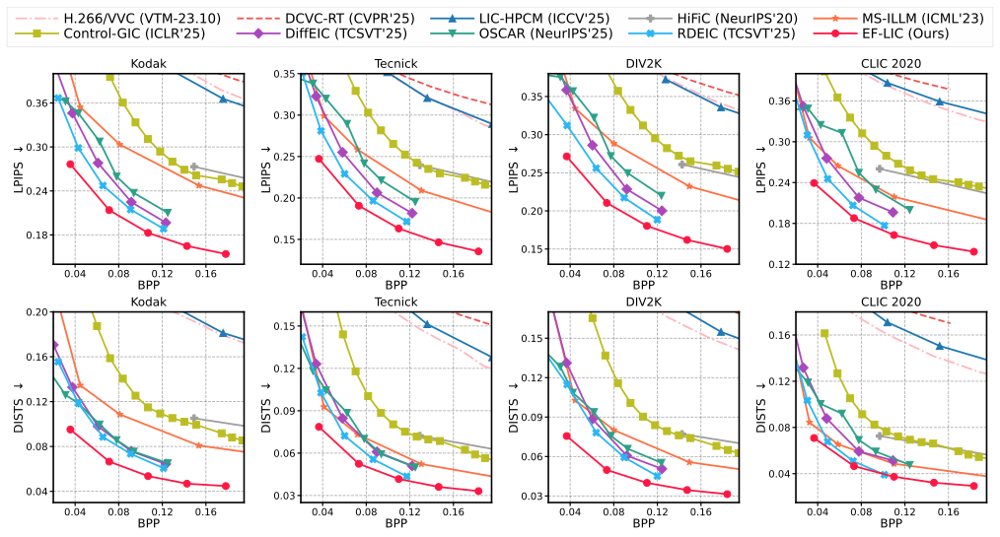
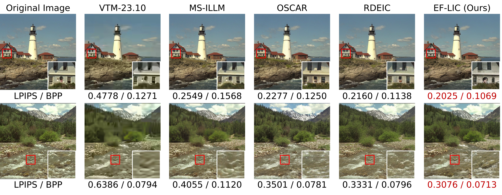

# Efficient Learned Image Compression without Entropy Coding

[](https://arxiv.org/abs/2605.23323)
[](https://icml.cc/virtual/2026/poster/61207)

Official inference code for **EF-LIC**, a multi-rate learned image compression model without entropy coding.

## 📝 Abstract

Entropy coding is widely used in typical learned image compression (LIC) that converts latents into a compact bitstream.
However, entropy coding is typically sequential and becomes the coding latency bottleneck.
To overcome it, we present Entropy-Coding Free Learned Image Compression (EF-LIC), a multi-rate framework that generates compact representation by removing statistical and correlation redundancy with low coding latency.
First, we introduce unconstrained vector quantization and prove that its index distribution approaches the maximum-entropy bound, yielding minimal statistical redundancy.
Second, we propose a context-conditioned autoregressive transform that directly reparameterizes the latents to reduce inter-dependency.
Theoretical analysis shows that EF-LIC can remove correlation redundancy as effectively as typical LIC with entropy coding, leading to comparable compression performance.
Experiments show EF-LIC achieves up to 67.86% bitrate reduction over MS-ILLM on Kodak with LPIPS.
Ablation studies further show EF-LIC matches the compression performance of its entropy-coding based variant while achieving over $3\times$ faster encoding and $5\times$ faster decoding.

## Repository layout

```text
.
├── EF_LIC.py                  # inference-only EF-LIC model
├── test.py                    # Kodak/test-folder evaluation script
├── requirements.txt
├── ckpt/
│   └── checkpoint.pth.tar     # put the downloaded checkpoint here
└── kodak/                     # put the dataset here
    ├── kodim01.png
    └── ...
```

## Environment

Python 3.12 is recommended. PyTorch should be newer than 2.0.

```bash
conda create -n <your_env_name> python=3.12 -y
conda activate <your_env_name>
pip install torch torchvision
pip install -r requirements.txt
```

The evaluation uses:

- `lpips` for LPIPS with VGG features.
- `dists-pytorch` for DISTS.
- `Pillow` and `torchvision` for image loading and tensor conversion.

## Checkpoint

Put the inference checkpoint at:

```text
ckpt/checkpoint.pth.tar
```

## Pretrained Checkpoints

You can download the pretrained inference checkpoint for **EF-LIC** from the following link:

* **[Download checkpoint here.](https://drive.google.com/file/d/1XrfmdUx0nFFBg9_ToVzz-A2jFZ5qiGR6/view?usp=sharing)**

## Test on Kodak

Default paths:

```bash
python test.py
```

Equivalent explicit command:

```bash
python test.py \
  --kodak-dir kodak \
  --ckpt-path ckpt/checkpoint.pth.tar
```

The script evaluates five rate points, `force_ind = 0, 1, 2, 3, 4`. For each image, it prints the latencies and quality metrics in the following format:

```text
Enc (ms) | Dec (ms) | PSNR | LPIPS | DISTS | BPP
```

After each rate point, it prints the average result over the image folder.

## Performance Evaluation

### Performance & Rate-Distortion Curves

Rate-distortion-perception comparison on benchmarks:
<p align="center">
  
</p>

<p align="center">
  
</p>

## Speed & Engineering Optimizations

This repository incorporates several engineering optimizations. As a result, the execution speed on the Kodak dataset outperforms the original baseline numbers reported in the paper.

### Macro Speed Comparison (ms)

The table below compares the macro average latency per image on the Kodak dataset between the paper's original implementation and this optimized codebase:

| Stage | Paper (Baseline) | This Repo (Optimized Avg) |
| :--- | :---: | :---: |
| **Encoding (Compress)** | 17.62 ms | 13.04 ms |
| **Decoding (Decompress)** | 13.72 ms | 11.52 ms |

> 📌 *Note: This Repo's data shows the overall average calculated across all 5 rate points (`force_ind = 0, 1, 2, 3, 4`).*

### Detailed Latency Breakdown by Rate Point

For more granular benchmarking, here is the average latency of this repository at each specific quality level:

| `force_ind` | Encoding (Compress) | Decoding (Decompress) |
| :---: | :---: | :---: |
| **0** | 10.59 ms | 11.30 ms |
| **1** | 11.73 ms | 11.39 ms |
| **2** | 13.23 ms | 11.69 ms |
| **3** | 13.70 ms | 11.53 ms |
| **4** | 15.76 ms | 11.69 ms |

## Citation

```bibtex
@article{cao2026efficient,
    title     = {Efficient Learned Image Compression without Entropy Coding},
    author    = {Cao, Hao and Guo, Wenqi and Qin, Zhijin and Han, Jungong},
    journal   = {arXiv preprint arXiv:2605.23323},
    year      = {2026}
}
```

## License

This project is licensed under the Creative Commons Attribution-NonCommercial-NoDerivatives 4.0 International License (CC BY-NC-ND 4.0).

See the [LICENSE](LICENSE) file for details.

## 🥰 Acknowledgement

This work is implemented based on [DCVC-RT](https://github.com/microsoft/DCVC). Thanks for their awesome work!

## :envelope: Contact

If you have any questions, please feel free to drop me an email: 

- caoh24[at]mails.tsinghua.edu.cn
# image_compression
